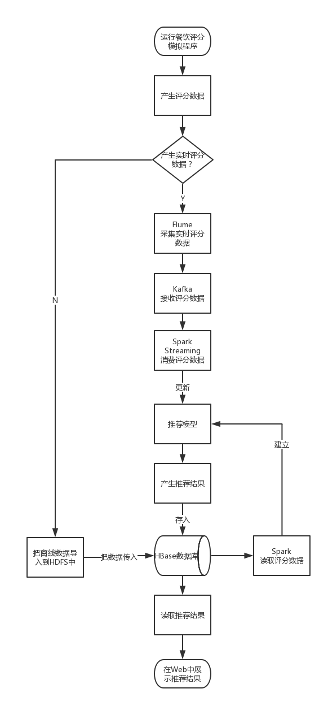
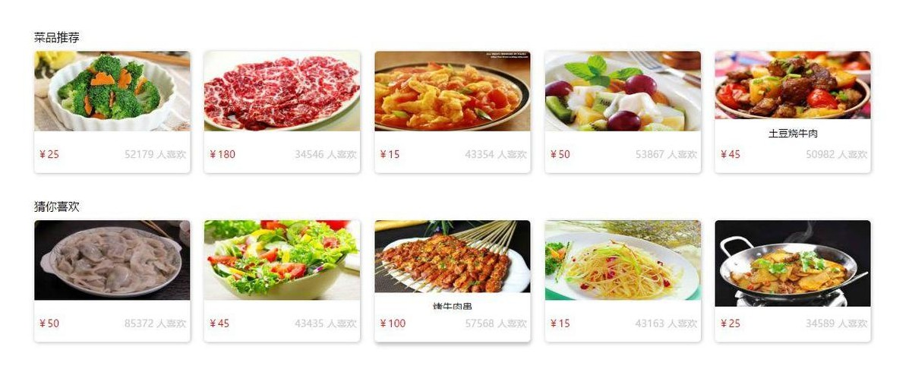

# SparkMLib_ALS_CommodityRecommendation
 SparkMLib ALS(Writed by Scala&Java) used in commodity recommendation system

 
## 概述

推荐引擎是最常见的机器学习应用，在spark中，Spark MLlib支持ALS（Alternating Least Squares）推荐算法，是机器学习的协同过滤推荐算法。机器学习的协同过滤推荐算法用过观察所有用户给产品的评价来推断每个用户的喜好，并向用户推荐适合的多个产品，也可以把某一个产品推荐给多个用户。
  
基于大数据的餐饮推荐系统，整体采用Lambda架构，读取餐饮评分数据并通过Spark的MLlib中的ALS建立推荐模型之后进行推荐。

这里是推荐引擎的代码，分为离线推荐和实时推荐。

## 系统设计

通过业务代码实现对餐饮的推荐，最终选用了 Spark MLlib 中的 ALS 算法。
　　考虑过基于用户或基于商品的算法进行相关推荐，自己生成的餐饮数据的数量与特征与以上不是很匹配，就选了个基于评分数据的协同过滤算法。
　　相对来说这是比较简单的一种方式。

　　如何在搭建好并经过连通性测试的大数据平台上进行业务代码的编写，也就是整合 ALS。22基于Spark机器学习跟实时流计算的智能推荐系统 给了我很大的启发。首先是在思想上的，这篇文章让我对 ALS 的原理与整个推荐系统的流程有了初步的认识。其次是将他的核心业务代码移植到我的毕业设计中去，虽然有些代码的细节具体用法不是很懂，但是大致上的意思能理解个大概。
　　计划在学习了 Scala 之后把注释写完整，思路再理一遍。
　　

作者的可视化界面使用 ASP.NET 编写的，出于节省内存的目的我这里采用的 Spring Boot框架整合 Thymeleaf模板。

&emsp;&emsp;&emsp;&emsp;&emsp;&emsp;&emsp;&emsp;&emsp;&emsp;&emsp;&emsp;&emsp;&emsp;

## 最终效果

&emsp;&emsp;&emsp;&emsp;&emsp;&emsp;&emsp;&emsp;&emsp;&emsp;&emsp;&emsp;&emsp;&emsp;